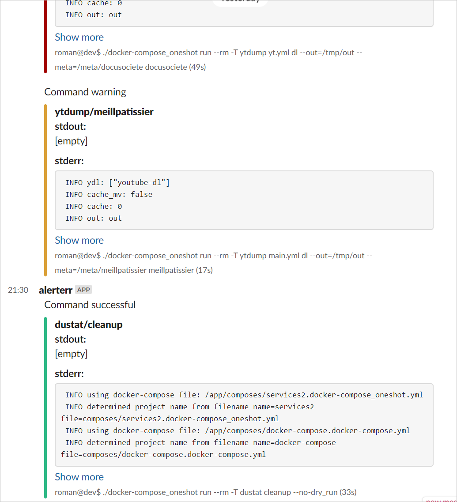

# alerterr

> Pipe any command's errors to Slack

Passes through stdout, stderr, and exit code as if the command was executed
directly. In case of non-zero exit-status, the contents of both output streams
is posted to a Slack webhook. Optionally upon success as well.

Example notifications:



## Install

1. Clone in, say, `~/code/alerterr`

2. Create a wrapper with a custom webhook in your `$PATH`:

    ```bash
    $ cat ~/bin/alerterr
    #!/usr/bin/env bash
    
    root=~/code/alerterr
    webhook="https://hooks.slack.com/services/AAA/BBB/CCC"
    
    export BUNDLE_GEMFILE="$root"/Gemfile
    
    exec bundle exec ruby "$root"/main.rb on_err "$webhook" "$@"
    ```

3. Use as `alerterr [options] -- command [arg ...]`

    The `alerterr` wrapper calls `main.rb on_err <webhook>` with its arguments
    forwarded as-is.

## Usage

```bash
$ alerterr -h
Usage: main.rb on_err webhook exe [args ...] --[no-]name --[no-]on_ok --[no-]on_out --[no-]on_err --[no-]on_log

Send a Slack notification upon non-zero exit-status.

Options:

  --name=NAME

      Custom name to appear in Slack. Defaults to the executable's filename.
  
  --on_ok

      Notify even upon success.

  --on_out=PATTERN

      Notify upon success if stdout matches PATTERN.
      PATTERN may be either string or a regex in the /.../ format.

  --on_err=PATTERN

      Notify upon success if stderr matches PATTERN.

Add -- before the command to disambiguate on_err options from the command's.
Not mandatory but recommended. Example:

  alerterr --name=foo -- du --summarize -h

```

## Other

This project relies on- and serves as a usage example for
[MetaCLI](https://github.com/Roman2K/metacli) to do the arg parsing.
